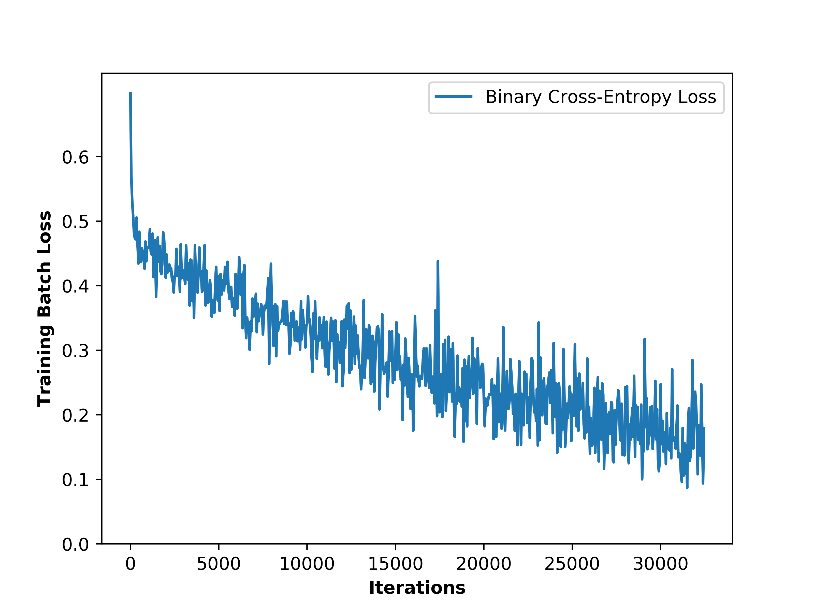
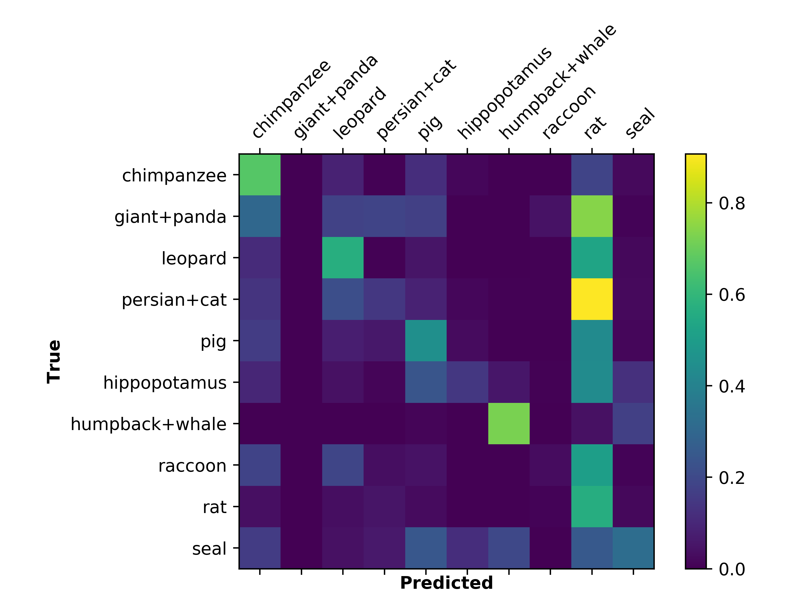

# Zero-Shot Learning on AwA2 Dataset

### Background
Zero-shot learning refers to applying supervised learning methods to unseen data. That is, the training set and testing set are disjoint. This is an interesting problem, since in the real world, training data is sparse and it's important that models can generalize well to novel data. This repository explores zero-shot learning using convolutional neural networks on the [Animals with Attributes 2](https://cvml.ist.ac.at/AwA2/) dataset (AwA2). AwA2 contains 37322 images of 50 different animal classes, each with 85 labeled attributes (e.g. "black", "small", "walks", "smart". The dataset at the above link provides a testing and training split. Each animal class has a length 85 binary attribute vector.

Instead of training a classifier to predict the animal directly, like in canonical object detection, one can predict attributes. These predicted attributes from the network can be used during inference time to find the closest animal class. Some similarity metrics for binary vectors include Hamming distance (i.e. number of inversions), cosine similarity, and Euclidean distance. I chose to use cosine similarity.

### Model
This repository uses ResNet50 (without pretraining) as the backbone, and adds a fully-connected layer to output a value for each of the attributes (85). ResNet by default outputs a 2048 dimensional feature vector in the fully-connected layer.
 I pass the 85 dimensional output through a sigmoid activation to get probabilities for each attribute. Binary cross-entropy loss is then used to train the network, since we are doing multi-label classification (as opposed to multi-class).

Typically in transfer learning / other supervised learning settings, one would use a pre-trained model (such as ResNet on ImageNet). Here though, using an ImageNet pre-trained model would violate the spirit of zero-shot learning, since ImageNet and AwA2 share some animal classes, and the idea of zero-shot learning is to be able to classify data unseen by the classifier.

### Training and Performance
I trained for just 25 epochs at a constant learning rate of 0.000025 using Adam optimizer, and got 35.5% accuracy on the testing set (which is entirely disjoint from the training set). This is not bad compared to some of the earlier literature using AwA2, but current state-of-art of zero-shot-learning on AwA2 is in the high 70% range. I suspect that my results would have been better if I had trained for longer, since the loss function  was still decreasing rapidly at the end of training.

Confusion Matrix:

### Python Libraries
- torch
- torchvision
- numpy
- matplotlib
- scikit-learn

